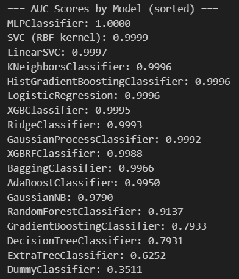
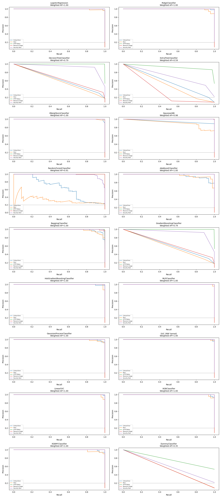
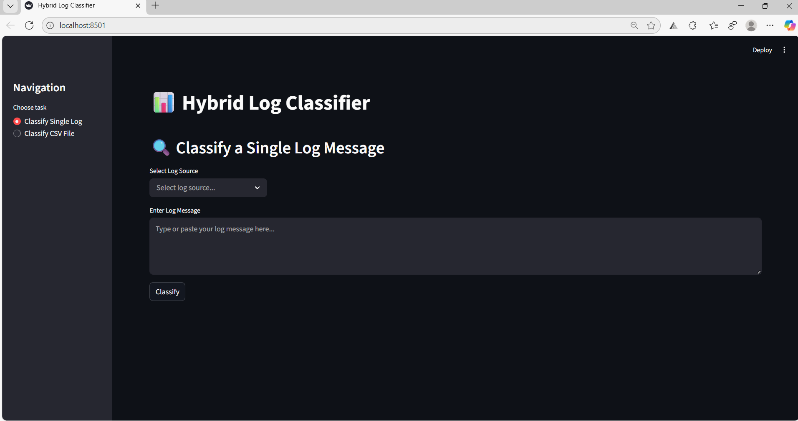
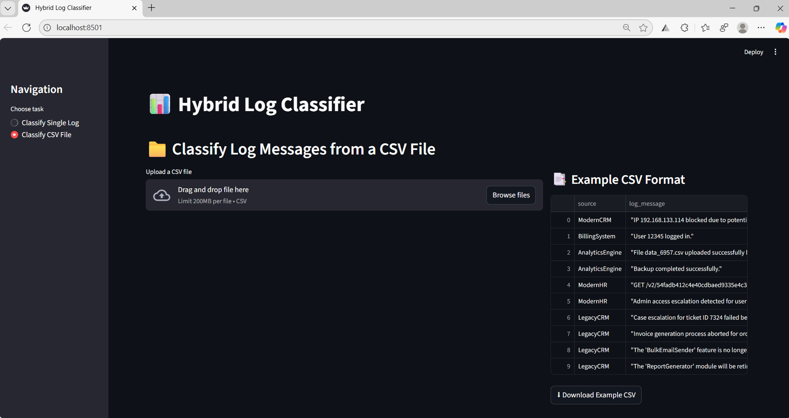

# Hybrid Log Classifier V1

A **Hybrid Log Classifier** that leverages **Regex**, **BERT embeddings**, and **LLM-based classification** to classify system and application logs efficiently. The project provides both single log prediction and CSV-based bulk classification with a user-friendly **Streamlit UI**.

---

## 🚀 Features

* **Regex-based Log Classification** (fast rule-based matching)
* **BERT-powered Classifier** (semantic embeddings + ML model)
* **LLM-based Log Understanding** (contextual classification)
* **Evaluation Metrics**: Precision, Recall, AUC, PR Curve
* **Streamlit UI** for single log & batch CSV classification
* **Modular Architecture** for easy extensibility

---

## 📂 Project Structure

```
HybridLogClassifier-V1/
│-- models/
│   ├── final_model.joblib
│   └── transformer_encoder/
│
│-- src/
│   ├── classifier.py
│   └── src_models/
│       ├── processor_bert.py
│       ├── processor_regex.py
│       └── processor_llm.py
│
│-- SRC_README/
│   ├── arch.png
│   ├── AveragePrecisionWeighted-AUC-Score.png
│   ├── CSVLogPredictionUI.png
│   ├── precision_recall_curve.png
│   └── SingleLogPredictionUI.png
│
│-- test/
│   └── test_log.csv
│
│-- training/
│   ├── 01-EDA.ipynb
│   ├── 02-Regex.ipynb
│   ├── 03-BERT.ipynb
│   ├── 04-LLMs.ipynb
│   ├── AveragePrecisionWeighted-AUC-Score.png
│   ├── precision_recall_curve.png
│   └── datasets/
│       ├── synthetic_logs.csv
│       ├── llm_df.csv
│       └── bert_df.csv
│
│-- .env
│-- .gitignore
│-- app.py
│-- main.py
│-- README.md
│-- requirements.txt
```

---

## 🏗️ Architecture


---

## 📊 Evaluation

### Precision-Recall & AUC




---

## 🖥️ Streamlit UI

### Single Log Prediction



### CSV Log Prediction



---

## ⚙️ Installation

```bash
# Clone the repository
git clone https://github.com/yourusername/HybridLogClassifier-V1.git
cd HybridLogClassifier-V1

# Create virtual environment
python -m venv venv
source venv/bin/activate   # (Linux/Mac)
venv\Scripts\activate      # (Windows)

# Install dependencies
pip install -r requirements.txt
```

---

## ▶️ Usage

### Run API

```bash
uvicorn main:app --reload
```

### Run Streamlit UI

```bash
streamlit run app.py
```

---

## 📚 Training

Training scripts and experiments are provided in the `training/` folder:

* **01-EDA.ipynb** → Exploratory Data Analysis
* **02-Regex.ipynb** → Regex-based classification
* **03-BERT.ipynb** → BERT embedding classifier
* **04-LLMs.ipynb** → LLM-powered classification

---

## 🧪 Testing

Run unit tests with:

```bash
pytest test/
```

---

## 🔮 Future Work

* Integration with **online log monitoring pipelines**
* Real-time **anomaly detection**
* Scaling with **distributed systems**

---

## 📜 License

Apache License | Version 2.0, January 2004 © 2025 Anbumani V